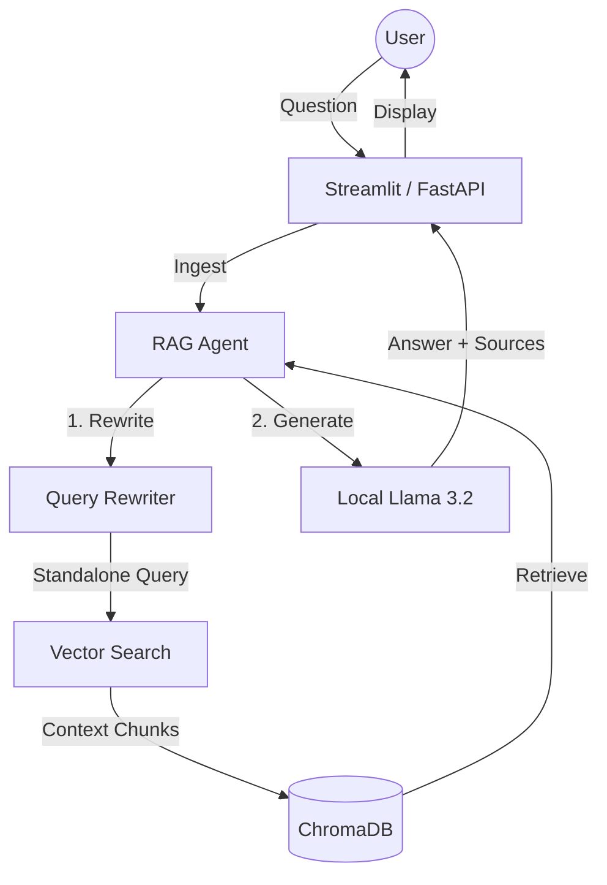

# Private RAG Knowledge Base Agent 🤖

A 100% local, privacy-first Retrieval-Augmented Generation (RAG) agent. No data leaves your machine, and no API keys are required.

## 🚀 Key Features

- **Local LLM Integration**: Powered by `onprem` and `Ollama` (defaulting to `llama3.2`).
- **Advanced RAG Pipeline**:
  - **Vector Database**: Semantic search using local ChromaDB.
  - **Query Rewriting**: Automatically refines vague follow-up questions for better retrieval.
  - **Chunking Control**: Configurable chunk size and overlap for precision.
  - **Inline Citations**: Transparently shows which documents were used for the answer.
- **Dual Interface**:
  - **FastAPI Backend**: Professional API for integration.
  - **Streamlit Frontend**: Intuitive, stylish chat interface.
- **Support for Multiple Formats**: PDF, DOCX, TXT, MD, and more.

## 🏗 Architecture



## 🛠 Installation

1. **Install Ollama**:
   Download and install from [ollama.com](https://ollama.com).

2. **Pull the Model**:
   ```bash
   ollama pull llama3.2
   ```

3. **Install Dependencies**:
   ```bash
   pip install -r requirements.txt
   ```

4. **Run the Application**:
   - **Streamlit (Recommended)**:
     ```bash
     streamlit run streamlit_app.py
     ```
   - **FastAPI**:
     ```bash
     python main.py
     ```

## 📁 Repository Structure

- `src/`: Core logic (Agent, Memory Manager, Utils).
- `templates/`: HTML templates for FastAPI.
- `data/`: Persistent storage for documents and vector database.
- `logs/`: Application logs (powered by Loguru).
- `tests/`: Automated test suite.

## 🔒 Privacy & Security

- **Local Processing**: All embeddings and LLM inferences happen on your local hardware.
- **No Cloud Dependency**: Works entirely offline after the initial setup.
- **Data Persistence**: Your documents are stored in `data/documents/` and indexed in `data/chroma_db/`.

---
*Built with Python, onprem, ChromaDB, and FastAPI.*
